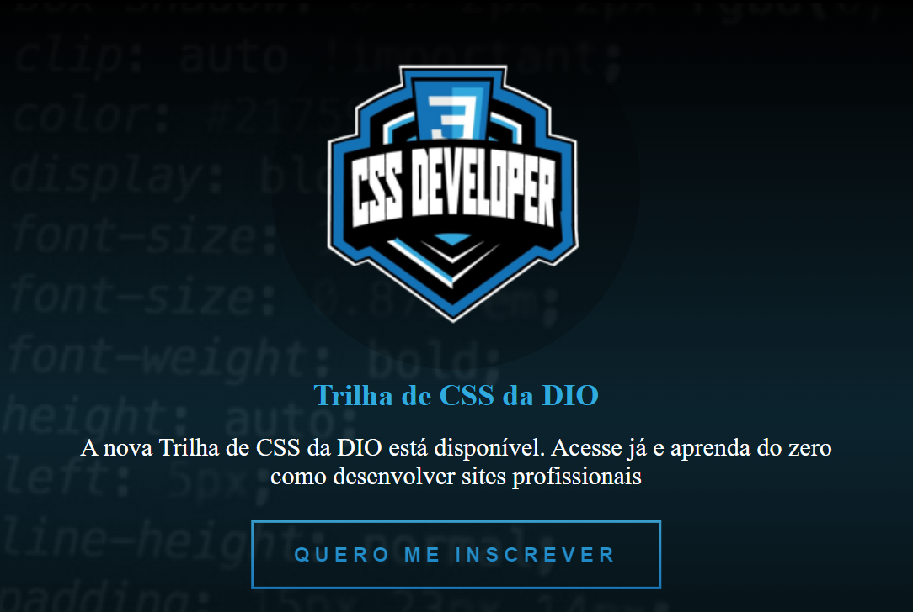
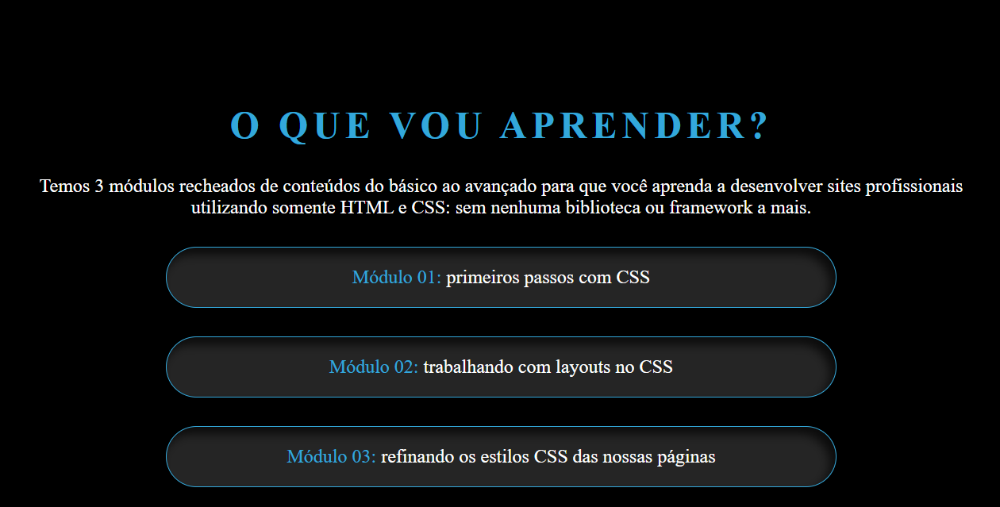

# SiteCompletoHTML-CSS_DIO

   - Bem vindo(a)  desafio Criando sua Primeira Landing Page com HTML e CSS da DIO! Nela, você vai construir sua primeira Landing Page com HTML e CSS, colocando em prática os fundamentos do CSS, as propriedades básicas da linguagem de estilização, além de trabalhar com as unidades de medidas relativas e absolutas que aprendemos ao longo da trilha.

* Criando sua Primeira Landing Page com HTML e CSS
- [Link do projeto:](https://finandolopes.github.io/Criando-sua-Primeira-Landing-Page-com-HTML-e-CSS/)
  
* Foi utilizado um protótipo via Figma para orientação de como o design deveria ficar;
  [Link do Figma](https://www.figma.com/file/3PiokoJj9IhGDnNiWAJbz7/DIO---Desafio-01?node-id=2%3A6) contendo o protótipo do desafio para
que você possa se basear.
  
* Header:

* Módulos:

* Transforme o futuro:

* Evolua:

* Footer:

